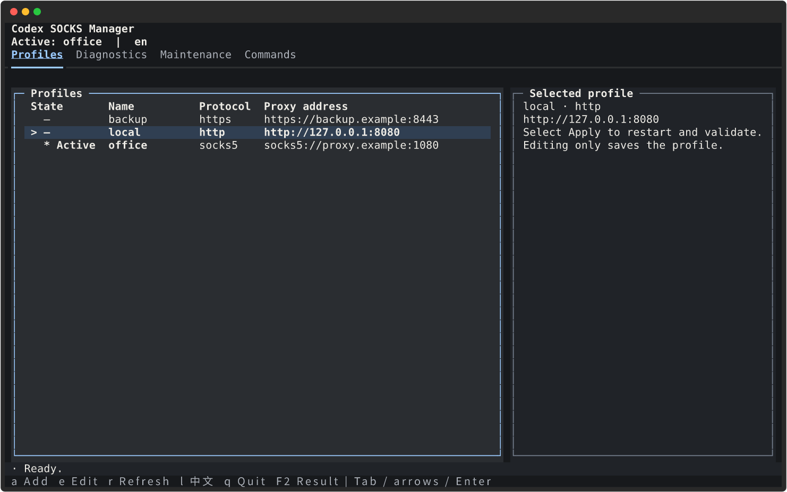

# Codex SOCKS Manager


> no more codex 403

[English](README.md) · [简体中文](README.zh-CN.md)

Codex updates can leave a working proxy setup behind. This Linux CLI keeps SOCKS and HTTP profiles in one place, passes them to Codex on every launch, and helps diagnose HTTPS or WebSocket failures. `no more codex 403` is the goal, not a blanket promise: account access, regional availability, workspace permissions, and remote authorization still apply.

## What it does

- Store named `socks5h://`, `socks5://`, `http://`, and `https://` profiles.
- Put a managed launcher in front of an existing standalone, npm, or pnpm Codex installation.
- Export uppercase and lowercase `HTTP_PROXY`, `HTTPS_PROXY`, and `ALL_PROXY` while preserving local bypasses in `NO_PROXY`.
- Switch profiles, restart matching current-user app-server roles, and restore the previous selection if validation fails.
- Turn Codex Doctor checks for HTTPS, WebSockets, app-server status, and the proxy environment into one summary.
- Back up and restore the proxy layer, with `codex-proxy-guard` kept as a compatible command.

## Why not just export a proxy variable?

An `export ALL_PROXY=...` is enough for one shell, but it does not manage endpoint changes, app-server restarts, or Codex updates. Codex SOCKS Manager saves multiple SOCKS and HTTP endpoints as named profiles. `use` selects one, restarts matching app-server roles for the current user, and checks the result with Doctor. If that check fails, it restores the previous selection.

Updates get a recovery path too. `safe-update` creates a snapshot before `codex update`, then repairs the managed launcher, restarts app-server, and validates the result. If the update or validation fails, it attempts to restore the snapshot.

## Quick start

You need Linux, Python 3.10+ with venv/pip support, and an existing Codex CLI installation. The default CLI has no third-party runtime dependencies. Textual and Rich are optional, for the TUI only; CLI tables use the standard library in both editions. `check` and profile-switch validation need a Codex version with `doctor --json`; `safe-update` also needs `codex update`.

```bash
git clone https://github.com/UMRzcz-831/codex-socks-manager.git
cd codex-socks-manager
./scripts/install.sh
export PATH="$HOME/.local/bin:$PATH"

# Enter the proxy URL at the hidden prompt.
codex-socks add office
codex-socks list

# Requires existing, matching Codex app-server processes.
codex-socks use office
codex-socks check
```

The installer creates a versioned virtual environment under `~/.local/share/codex-socks-manager/venvs/`. It installs the selected edition, checks its imports and locates Codex before replacing user-local commands and `~/.local/bin/codex`; the TUI edition also checks UI resources. Dependency or preflight failures leave the old entry points intact; previous environments and private bootstrap backups are retained for recovery. Installation still needs build tools from a package index or a configured local wheel source. If venv creation fails, install your distribution's venv support (for example, `python3-venv` on Debian/Ubuntu).

| Edition | From the project directory | pip, in the target Python environment |
| --- | --- | --- |
| CLI (default) | `./scripts/install.sh` | `python3 -m pip install .` |
| CLI + TUI | `./scripts/install.sh --with-tui` | `python3 -m pip install '.[tui]'` |

Each installer run selects a new environment. Keep `--with-tui` when upgrading the full edition; rerunning without it switches the entry points to a fresh CLI-only environment. Profiles and old environments are retained. Adding TUI later uses the same `--with-tui` command, not pip inside the managed venv. A plain pip reinstall does not remove previously installed extras; use a fresh environment for a strictly lightweight installation. `./scripts/install.sh --help` lists the options.

If `~/.local/bin/codex` is a custom launcher, back it up first. Put `~/.local/bin` early in your shell's `PATH`. To choose the Python used to create the environment, run `PYTHON=/path/to/python3 ./scripts/install.sh`. Existing source-copy installations can migrate by rerunning the installer; profile locations do not change.

For a pip installation, run `python3 -m pip install .` in the Python environment you want to keep, then run `codex-socks install` there. The generated launcher continues to use that environment's interpreter.

## Interactive manager

After installing the TUI edition, run `codex-socks` in an interactive terminal, or explicitly run `codex-socks tui`. Four tabs cover profiles, Doctor diagnostics, maintenance, and a searchable command manual. The graphite theme uses warm-white text, ice-blue focus, and thin panel borders. At 100 columns or wider, lists and details split roughly 65% / 35%; narrower terminals stack them. The profile table separates the `>` selected row from the `*` active proxy. Editing saves a profile; choose Apply to restart app-server and validate it.

Use the mouse, Tab, arrow keys and Enter to navigate. Shortcuts are `a` (add), `e` (edit), `r` (refresh local data), `l` (switch language), `q` (quit), and `F2` (full operation result). Focus a details panel with Tab and use arrows or Page Up / Page Down to scroll. Letter shortcuts are inactive while typing in a field. Use at least 80 columns by 24 rows; content scrolls within that layout, while smaller terminals show a size warning. Operations that restart processes or replace data explain their effects before confirmation. While an operation or rollback runs, duplicate submissions and normal exit are blocked.

Diagnostics run only when requested. A previous result is marked stale after an operation or local refresh; it is not a live connectivity indicator.



See the [real TUI screenshots and verification notes](docs/designs/tui-graphite/rendered/README.md) for both terminal sizes. These use fake profiles, not live diagnostics.

```bash
codex-socks tui --lang zh-CN
codex-socks --lang en list
CODEX_SOCKS_LANG=zh-CN codex-socks
```

`--lang` works before or after a subcommand. The language order is explicit option, `CODEX_SOCKS_LANG`, then `LC_ALL` / `LC_MESSAGES` / `LANG`; Chinese locales use simplified Chinese and other locales use English. Switching inside the TUI lasts for that session. JSON output is unchanged.

Without UI dependencies, a bare `codex-socks` prints help and returns 0; explicit `tui` gives installation instructions and returns 2. Without an interactive terminal (or with `TERM=dumb`), a bare invocation also prints help and returns 0, while explicit `tui` reports the terminal requirement and returns 2. CLI tables always use plain text without ANSI escapes. `NO_COLOR` does not prevent entering an installed TUI; text and symbols still distinguish states.

## Commands

| Command | Behavior | Example |
| --- | --- | --- |
| `add NAME [URL]` | Create a profile; omitting URL opens a hidden prompt. | `codex-socks add office` |
| `list` | Show a table with state, name, protocol and masked proxy address. | `codex-socks list` |
| `list --json` | Output profiles and active selection as JSON for scripts. | `codex-socks list --json` |
| `use NAME` | Select a profile, restart matching app-server roles, and validate. | `codex-socks use office` |
| `use off` / `off` | Clear managed proxy variables, restart, and validate direct connectivity. | `codex-socks use off` / `codex-socks off` |
| `edit NAME` | Edit via `$EDITOR` in a `0600` temporary file; validate before replacement. | `EDITOR=vi codex-socks edit office` |
| `del NAME` | Delete an inactive profile. | `codex-socks del office` |
| `del NAME --force` | Switch an active profile to off and validate before deleting it. | `codex-socks del office --force` |
| `check` | Print a JSON summary of Codex Doctor results; return 1 when unhealthy. | `codex-socks check` |
| `install` | Discover Codex and install or repair the managed launcher. | `codex-socks install` |
| `backup` | Create a local snapshot, including Codex configuration when present. | `codex-socks backup` |
| `restore [SNAPSHOT]` | Restore the proxy layer; defaults to the latest known-good snapshot. | `codex-socks restore` / `codex-socks restore /path/to/snapshot` |
| `safe-update` | Back up, invoke `codex update`, repair the launcher, restart, and validate. | `codex-socks safe-update` |
| `migrate-legacy [--jp PATH] [--us PATH]` | Import old JP/US environment files without sourcing shell code. | `codex-socks migrate-legacy --jp /path/to/jp.env --us /path/to/us.env` |
| `tui` | Open the optional manager; also the interactive default when UI dependencies are installed. | `codex-socks tui` |

Use `codex-socks -h` for the command table and `codex-socks COMMAND -h` for parameters, examples, and behavior notes. A backup's `known-good` label does not itself run a health check.

Set an editor for one invocation with `EDITOR=vi codex-socks edit office`. Editing an active profile does not restart anything; run `codex-socks use office` afterward to apply and validate the change.

Applying a profile can interrupt an active Codex session because the manager restarts the app-server roles it finds. It will not start an app-server that is absent. If direct connectivity is unavailable, `off` can fail validation and roll back.

Passing the URL directly is convenient for a credential-free local proxy:

```bash
codex-socks add local socks5h://127.0.0.1:1080
```

Use the hidden prompt for real credentials. A positional URL can remain in shell history or process arguments. `list` masks the username and password, but it still prints the host and port, so check its output before sharing it.

## Unsupported regions: API examples

OpenAI publishes a [list of countries and territories supported by its API](https://help.openai.com/en/articles/5347006-openai-api-supported-countries-and-territories), but no separate unsupported list. When checked on **2026-09-07**, the following examples were absent:

- Mainland China, Hong Kong, Macao, Iran, North Korea.
- Russia, Belarus.
- Cuba, Venezuela.

This is not a complete official blacklist; it is a short set of examples inferred from the published list. Ukraine appears on the list with certain exceptions. Check the linked page for the latest wording.

The source covers API availability, not every Codex or ChatGPT sign-in arrangement. OpenAI says access from unsupported locations may lead to an account block or suspension. A proxy does not change service eligibility or grant account or workspace permissions.

## Diagnostics and connectors

```bash
codex-socks check
```

The JSON response contains `https`, `wss`, `app_server`, and `proxy_env`, along with the overall `ok` value and a `category`. These fields come from Doctor output. A green result does not audit every file permission, child-process environment, or connector operation.

The 403 classification looks for keywords in Doctor output. Categories such as `authorization` and `proxy_transport` are clues, not a verdict. If fixing the transport does not restore access, check the account, workspace permissions, and remote ACLs.

For `codex_apps`/MCP, finish with a read-only smoke test for the connector you use:

1. Run `codex-socks check` and inspect the summary.
2. In Codex, ask an already connected app to read an item you are authorized to access, such as an issue title.
3. Confirm that the expected result arrives without a transport or authorization error. Keep raw responses and diagnostics private when they contain sensitive information.

## Updates and recovery

```bash
codex-socks backup
codex-socks safe-update

# To recover from an existing known-good snapshot:
codex-socks restore
```

`safe-update` snapshots the proxy layer, asks the configured real Codex executable to update, reinstalls the launcher, restarts app-server roles, and runs Doctor. If a step fails, it tries to restore the snapshot. It never copies or downgrades Codex binaries. Run `check` before the update so you have a healthy baseline, then review any recovery errors.

`restore` first creates a pre-restore snapshot. It then restores the manager settings, profiles, and saved launcher while keeping the current binary path. Profiles missing from the chosen snapshot leave active storage but remain available in the pre-restore snapshot. `backup` also saves `~/.codex/config.toml` when it exists; `restore` does not write that Codex configuration back automatically.

The `codex-proxy-guard` compatibility entry point forwards `backup`, `check`, `restore`, and `safe-update` to the same implementation.

## Local storage and legacy migration

| Data | Default location |
| --- | --- |
| Manager settings and profiles | `~/.config/codex-socks-manager/` |
| Snapshots and state | `~/.local/state/codex-socks-manager/` |
| Package installed by the shell installer | `~/.local/share/codex-socks-manager/` |
| User commands and Codex launcher | `~/.local/bin/` |

`XDG_CONFIG_HOME`, `XDG_STATE_HOME`, and the shell installer's `XDG_DATA_HOME` override these roots. Sensitive directories use `0700`; settings and profile files use `0600`. Credentials remain plaintext on your machine, so protect snapshots as carefully as the original profiles.

To import an older setup:

```bash
codex-socks backup
codex-socks migrate-legacy \
  --jp ~/.config/openai-proxy/jp.env \
  --us ~/.config/openai-proxy/us.env
```

Omit both paths to use those legacy locations. Importing an identical profile again is safe; the command rejects an existing profile with different content. Migration leaves the active selection alone. Choose the imported profile with `use` when you are ready to restart.

Never put real proxy URLs, host details, credentials, snapshots, Doctor output, or runtime logs in public Git, Issues, or CI logs. The repository has ignore rules and a heuristic secret scanner, but you still need to review the staged diff.

## Contributing

See [AGENTS.md](AGENTS.md) for project-specific working guidance and [SECURITY.md](SECURITY.md) for vulnerability reports. Keep the English and Chinese usage instructions aligned. Use OpenSpec when a structured change is requested; documentation-only changes can set `skip_specs: true`.

Install development dependencies in an isolated environment:

```bash
python3 -m venv .venv
.venv/bin/python -m pip install -e '.[test,tui]'
git config core.hooksPath .githooks
```

Run the checks that match your change:

```bash
git diff --check
python3 scripts/check-secrets.py
openspec validate refresh-readmes-and-agent-guidance --strict
# For Python or shell changes:
.venv/bin/python -m pytest
.venv/bin/python -m compileall -q src tests
shellcheck .githooks/pre-commit scripts/install.sh
```

CI also exercises real installation and upgrade in disposable environments. To run that test locally, prepare a wheel directory with `pip wheel . 'setuptools>=68' wheel --wheel-dir /path/to/wheels`, then set `CODEX_SOCKS_TEST_WHEELHOUSE=/path/to/wheels` when running pytest. Without it, only the offline installation integration test is skipped; the installation failure tests still run.

Licensed under MIT. See [LICENSE](LICENSE).
