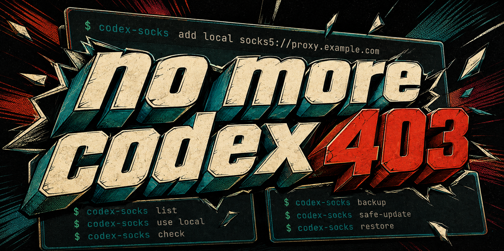
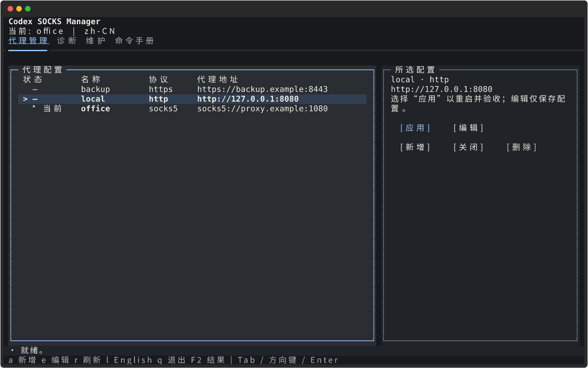

# Codex SOCKS Manager



> no more codex 403

[English](README.md) · [简体中文](README.zh-CN.md)

Codex 更新后，原本可用的代理设置可能失效。这个 Linux 命令行工具集中管理 SOCKS/HTTP 配置，让 Codex 每次启动都带上正确的代理变量，也能排查 HTTPS 和 WebSocket 故障。`no more codex 403` 是目标，不是对所有 403 的保证：账号访问、服务地区、workspace 权限和远端授权仍有各自的限制。

## 能做什么

- 保存具名 `socks5h://`、`socks5://`、`http://`、`https://` 代理配置。
- 在已有 standalone、npm 或 pnpm Codex 安装前放置受管 launcher。
- 注入大小写 `HTTP_PROXY`、`HTTPS_PROXY`、`ALL_PROXY`，同时在 `NO_PROXY` 中保留本地直连项。
- 切换配置、重启当前用户的匹配 app-server 角色；验收失败时恢复之前的选择。
- 把 Codex Doctor 的 HTTPS、WebSocket、app-server 和代理环境检查整理成一份摘要。
- 备份和恢复代理层，并保留 `codex-proxy-guard` 兼容命令。

## 为什么不直接设置代理变量？

临时执行 `export ALL_PROXY=...`，只管当前 shell。切换节点、重启 app-server 或更新 Codex 后，还要自己确认代理是否真正生效。Codex SOCKS Manager 把多个 SOCKS/HTTP 地址保存为具名 profile。执行 `use` 后，它会重启当前用户下匹配的 app-server，并通过 Doctor 验收；验收失败，就恢复之前的选择。

更新也有单独的恢复路径。`safe-update` 会在 `codex update` 前创建快照，更新后修复受管 launcher、重启 app-server 并验收。更新或验收失败时，它会尝试恢复这份快照。

## 快速开始

你需要 Linux、支持 venv/pip 的 Python 3.10+，并且已经安装 Codex CLI。默认 CLI 没有第三方运行依赖。Textual 和 Rich 仅随选装的 TUI 安装；两种版本的 CLI 表格都使用标准库。`check` 和配置切换验收要求 Codex 支持 `doctor --json`；`safe-update` 还要求支持 `codex update`。

```bash
git clone https://github.com/UMRzcz-831/codex-socks-manager.git
cd codex-socks-manager
./scripts/install.sh
export PATH="$HOME/.local/bin:$PATH"

# 在隐藏输入提示中粘贴代理 URL。
codex-socks add office
codex-socks list

# 需要已有可匹配的 Codex app-server 进程。
codex-socks use office
codex-socks check
```

安装器会在 `~/.local/share/codex-socks-manager/venvs/` 中创建版本化虚拟环境，安装所选版本、检查导入并找到 Codex 后，再替换用户本地命令和 `~/.local/bin/codex`；完整版还会检查界面资源。依赖安装或预检失败会保留旧入口；旧环境和私有 bootstrap 备份也会保留，供恢复使用。构建工具仍需要从包索引或已配置的本地 wheel 源获取。若无法创建 venv，请安装发行版对应的支持包，例如 Debian/Ubuntu 的 `python3-venv`。

| 版本 | 在项目目录执行 | 在目标 Python 环境中使用 pip |
| --- | --- | --- |
| 轻量 CLI（默认） | `./scripts/install.sh` | `python3 -m pip install .` |
| CLI + TUI | `./scripts/install.sh --with-tui` | `python3 -m pip install '.[tui]'` |

每次运行安装器都会创建新环境。完整版升级时继续带 `--with-tui`；不带选项会把入口切换到新的轻量 CLI 环境，保留代理配置和旧环境。后续补装界面也使用 `--with-tui`，不要在受管 venv 中自行运行 pip。普通 pip 重装不会移除已装的 extra；需要严格轻量时请用新环境。执行 `./scripts/install.sh --help` 可查看选项。

如果 `~/.local/bin/codex` 是你自己的 launcher，请先备份。把 `~/.local/bin` 放到 shell 的 `PATH` 前部。要指定创建环境的 Python，可运行 `PYTHON=/path/to/python3 ./scripts/install.sh`。之前通过复制源码安装的用户重新运行安装器即可迁移，代理配置的位置不变。

也可以在准备长期保留的 Python 环境里执行 `python3 -m pip install .`，然后在同一环境运行 `codex-socks install`。生成的 launcher 会继续使用该环境的解释器。

## 交互管理界面

安装完整版后，在交互终端运行 `codex-socks`，或显式执行 `codex-socks tui`。四个标签页分别管理代理、运行 Doctor 诊断、执行维护、查询命令手册。石墨黑主题采用暖白文字、冰蓝焦点和细边框；宽度达到 100 列时，列表与详情按约 65%／35% 分栏，窄屏改为上下排列。代理表格以 `>` 标出选中行，以 `*` 标出当前活动配置。编辑只保存配置；需要重启 app-server 并验收时，另选“应用”。

可以用鼠标、Tab、方向键和 Enter 导航。快捷键为 `a` 新增、`e` 编辑、`r` 刷新本地数据、`l` 切换语言、`q` 退出、`F2` 查看完整操作结果。用 Tab 聚焦详情，再用方向键或 Page Up／Page Down 滚动。在输入框中打字时，字母快捷键不会触发。终端至少使用 80 列、24 行，内容区可滚动；更小的终端会显示尺寸提示。涉及重启进程或替换数据的操作会先说明影响，再由你确认。操作及回滚执行期间，会阻止重复提交和普通退出。

诊断只在主动请求时执行。其他操作或本地刷新后，旧结果会标为过期，不能当作实时连通性状态。



两种终端尺寸的 [实际 TUI 截图与验收记录](docs/designs/tui-graphite/rendered/README.md)使用假配置生成，不是实时诊断结果。

```bash
codex-socks tui --lang zh-CN
codex-socks --lang en list
CODEX_SOCKS_LANG=zh-CN codex-socks
```

`--lang` 可放在子命令前后。语言依次取显式参数、`CODEX_SOCKS_LANG`、`LC_ALL` / `LC_MESSAGES` / `LANG`；中文 locale 使用简体中文，其余使用英文。TUI 内切换语言仅影响本次会话，JSON 输出不翻译。

未装界面依赖时，单独运行 `codex-socks` 显示帮助并返回 0；显式 `tui` 给出安装说明并返回 2。非交互环境或 `TERM=dumb` 下，无参数同样显示帮助并返回 0，显式 `tui` 则说明终端要求并返回 2。CLI 表格始终使用无 ANSI 的纯文本。`NO_COLOR` 不会阻止进入已安装的 TUI，文字和符号仍会区分状态。

## 命令速查

| 命令 | 行为 | 示例 |
| --- | --- | --- |
| `add NAME [URL]` | 新增配置；不传 URL 时隐藏输入。 | `codex-socks add office` |
| `list` | 以表格展示状态、名称、协议及脱敏代理地址。 | `codex-socks list` |
| `list --json` | 以 JSON 输出配置和活动选择，供脚本使用。 | `codex-socks list --json` |
| `use NAME` | 切换配置，重启匹配的 app-server 并验收。 | `codex-socks use office` |
| `use off` / `off` | 清除受管代理变量，重启并验收直连。 | `codex-socks use off` / `codex-socks off` |
| `edit NAME` | 通过 `$EDITOR` 编辑 `0600` 临时文件，校验后替换。 | `EDITOR=vi codex-socks edit office` |
| `del NAME` | 删除非活动配置。 | `codex-socks del office` |
| `del NAME --force` | 活动配置先切换 off 并验收，再删除。 | `codex-socks del office --force` |
| `check` | 输出 Codex Doctor 的 JSON 汇总，异常时返回 1。 | `codex-socks check` |
| `install` | 发现 Codex，安装或修复受管 launcher。 | `codex-socks install` |
| `backup` | 创建本地快照，存在 Codex 配置时一并备份。 | `codex-socks backup` |
| `restore [SNAPSHOT]` | 恢复代理层；默认使用最新 known-good 快照。 | `codex-socks restore` / `codex-socks restore /path/to/snapshot` |
| `safe-update` | 备份、调用 `codex update`、修复 launcher、重启并验收。 | `codex-socks safe-update` |
| `migrate-legacy [--jp PATH] [--us PATH]` | 导入旧 JP/US 环境文件，不执行其中的 shell 代码。 | `codex-socks migrate-legacy --jp /path/to/jp.env --us /path/to/us.env` |
| `tui` | 打开选装界面；装有界面依赖时也是交互终端下的默认入口。 | `codex-socks tui` |

执行 `codex-socks -h` 查看命令表格，执行 `codex-socks COMMAND -h` 查看参数、示例和行为说明。备份的 `known-good` 标签本身不代表已执行健康检查。

用 `EDITOR=vi codex-socks edit office` 可以为单次操作指定编辑器。编辑活动配置不会重启进程；完成后执行 `codex-socks use office`，应用并验收改动。

应用配置时，管理器会重启找到的 app-server 角色，因此可能中断当前 Codex 会话。它不会启动一个原本不存在的 app-server。直连不可用时，`off` 可能无法通过验收并回滚。

无凭据的本地代理可以直接传入 URL：

```bash
codex-socks add local socks5h://127.0.0.1:1080
```

真实凭据应通过隐藏提示输入。命令行里的 URL 可能留在 shell history 或进程参数中。`list` 会隐藏用户名和密码，但仍会显示主机与端口，分享前请检查输出。

## 不支持的地区：API 列表示例

OpenAI 发布了 [API 支持的国家和地区列表](https://help.openai.com/en/articles/5347006-openai-api-supported-countries-and-territories)，但没有单独发布不支持清单。我们在 **2026-09-07** 核对时，以下地点未出现在列表中：

- 中国大陆、香港、澳门、伊朗、朝鲜。
- 俄罗斯、白俄罗斯。
- 古巴、委内瑞拉。

这不是官方完整黑名单，只是根据支持列表整理的部分示例。乌克兰列在支持地区中，但附有部分例外。最新表述以原文为准。

这个来源只说明 API 的可用范围，不能代表所有 Codex 或 ChatGPT 登录方式的地区政策。OpenAI 提醒，从不支持的地区访问服务可能导致账号被封禁或暂停。代理不会改变服务资格，也不会授予账号或 workspace 权限。

## 诊断与连接器验收

```bash
codex-socks check
```

JSON 结果包含 `https`、`wss`、`app_server`、`proxy_env`，以及总体 `ok` 和 `category`。这些字段来自 Doctor 输出。显示为正常，并不代表所有文件权限、子进程环境或连接器操作都经过了审计。

403 分类通过 Doctor 输出中的关键词判断。`authorization` 和 `proxy_transport` 是排查线索，不是最终结论。如果修好传输链路后仍无法访问，请检查账号、workspace 权限和远端 ACL。

使用 `codex_apps`/MCP 时，还应对实际连接器做一次只读 smoke test：

1. 执行 `codex-socks check` 并查看汇总。
2. 在 Codex 中让已连接的应用读取你有权限访问的内容，例如一个 Issue 标题。
3. 确认返回了预期内容，且没有传输或授权错误。如果原始响应和诊断输出含有敏感信息，只在本机保存。

## 更新与恢复

```bash
codex-socks backup
codex-socks safe-update

# 从已有 known-good 快照恢复：
codex-socks restore
```

`safe-update` 先为代理层创建快照，再让已配置的真实 Codex 执行更新，随后重装 launcher、重启 app-server 并运行 Doctor。任何一步失败时，它会尝试恢复快照。这个过程不会复制或降级 Codex 二进制。更新前先运行 `check`，留下正常基线；更新后留意恢复错误。

`restore` 会先创建 pre-restore 快照，然后恢复管理器设置、profiles 和保存的 launcher，同时保留当前二进制路径。选定快照里没有的 profile 会离开活动存储，但仍可从 pre-restore 快照找回。`backup` 也会保存已有的 `~/.codex/config.toml`；`restore` 不会自动把这份 Codex 配置写回去。

`codex-proxy-guard` 是兼容入口，它把 `backup`、`check`、`restore` 和 `safe-update` 转给同一套实现。

## 本地存储与旧配置迁移

| 数据 | 默认位置 |
| --- | --- |
| 管理器设置、代理配置 | `~/.config/codex-socks-manager/` |
| 快照和状态 | `~/.local/state/codex-socks-manager/` |
| shell 安装器部署的 Python 包 | `~/.local/share/codex-socks-manager/` |
| 用户命令、Codex launcher | `~/.local/bin/` |

`XDG_CONFIG_HOME`、`XDG_STATE_HOME` 和 shell 安装器使用的 `XDG_DATA_HOME` 可以覆盖这些根目录。敏感目录使用 `0700`；设置与 profile 文件使用 `0600`。凭据会以明文留在本机，因此快照也要按原始 profile 的标准保护。

导入旧配置：

```bash
codex-socks backup
codex-socks migrate-legacy \
  --jp ~/.config/openai-proxy/jp.env \
  --us ~/.config/openai-proxy/us.env
```

不传路径时使用上面的默认位置。重复导入相同 profile 是安全的；如果已有同名 profile 但内容不同，命令会拒绝覆盖。迁移不会改变活动选择。准备重启时，再通过 `use` 选择导入的配置。

不要把真实代理 URL、主机信息、凭据、快照、Doctor 输出或运行日志放进公开 Git、Issues 和 CI 日志。仓库提供了忽略规则与启发式密钥扫描，但提交前仍要检查暂存 diff。

## 参与开发

项目协作约定见 [AGENTS.md](AGENTS.md)，漏洞报告方式见 [SECURITY.md](SECURITY.md)。涉及使用方式的修改要同步更新中英文文档。需要结构化记录时使用 OpenSpec；纯文档变更可以设置 `skip_specs: true`。

在隔离环境安装开发依赖：

```bash
python3 -m venv .venv
.venv/bin/python -m pip install -e '.[test,tui]'
git config core.hooksPath .githooks
```

按改动内容选择检查：

```bash
git diff --check
python3 scripts/check-secrets.py
openspec validate refresh-readmes-and-agent-guidance --strict
# Python 或 shell 改动适用：
.venv/bin/python -m pytest
.venv/bin/python -m compileall -q src tests
shellcheck .githooks/pre-commit scripts/install.sh
```

CI 还会在一次性环境中验证真实安装和升级。本地可先执行 `pip wheel . 'setuptools>=68' wheel --wheel-dir /path/to/wheels` 准备 wheel 目录，再在运行 pytest 时设置 `CODEX_SOCKS_TEST_WHEELHOUSE=/path/to/wheels`。未设置时只跳过离线安装集成测试，安装失败保护测试仍会运行。

项目采用 MIT 许可证，见 [LICENSE](LICENSE)。
