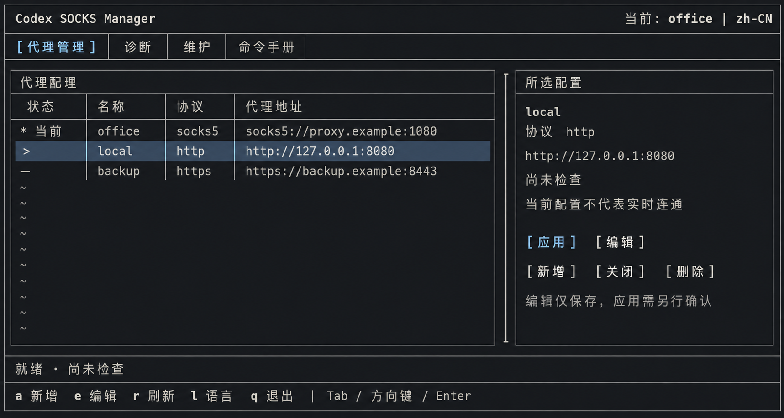
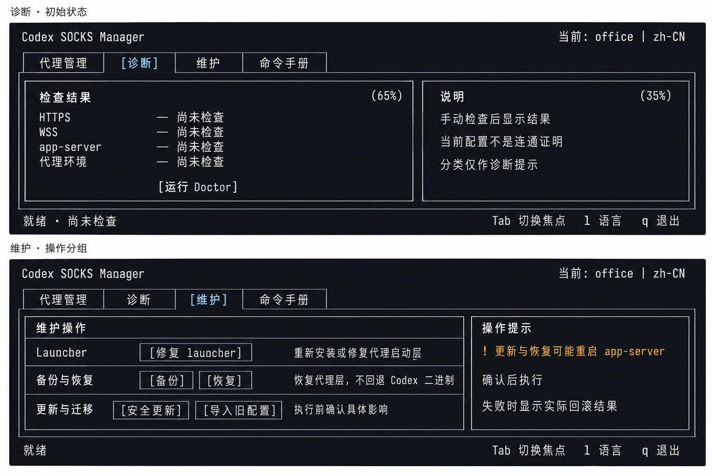
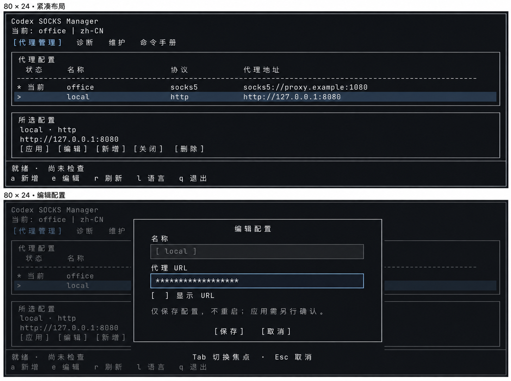

# 石墨黑 TUI 视觉原型

实现后的 [Textual 实际渲染与验收](rendered/README.md)单独保存；下方仍是 imagegen 概念参考，不应混淆。

2026-09-08 使用内置 imagegen 生成。目标框架为 Textual，沿用 designing-tuis 已确认的分区、比例和状态规则；本次按用户要求输出位图参考，没有生成 UI 代码。

这些图用于说明视觉层次，不是运行截图，也不替代 [OpenSpec 设计](../../../openspec/changes/make-tui-optional-and-redesign-interface/design.md)和[行为规格](../../../openspec/changes/make-tui-optional-and-redesign-interface/specs/terminal-ui/spec.md)。精确文案、尺寸、键盘行为及安全约束以规格和实现测试为准。[完整生成提示词](PROMPTS.md)供后续调整使用。

## 1. 宽屏代理管理

参考重点：石墨黑底、暖白正文、冰蓝强调，细边框分区。主列表／详情目标为 65%／35%；高亮行的 `>` 和活动配置的 `* 当前` 分开表达，移动光标不能切换代理。

## 2. 诊断与维护

参考重点：诊断默认“尚未检查”；维护按用途分组，警告用符号与文字共同表达，不铺大面积橙红底色。上下是两个独立页面，不是同一页面的两个区域。

## 3. 窄屏与编辑弹窗

参考重点：小于 100 列时由双栏改为上下排列；URL 默认隐藏，编辑只保存，应用另行确认。两幅图分别表示普通页和打开弹窗后的状态。

## 开发时不要照搬的生成细节

- 图中的 `120×36`／`80×24` 意图不是经过字格测量的结果。图片比例、字符宽度、弹窗宽度和可见行数都不能作为精确坐标；按设计的响应式约束实现，在两个真实目标尺寸中用 Pilot 验证。
- 图 1 自动增加的外框、中央装饰线和空行 `~` 不属于产品要求，应省去。统一使用面板细单线边框，不再加全屏装饰框。
- 图 2 中的 `65%`／`35%` 是生成的说明性标注，不显示在应用中；页面分组、按钮顺序和交互以 OpenSpec 为准。该图页脚被合并为一行，实际仍实现常驻两行状态／快捷键。
- 所有页面均使用同一字体和主题 token；不要复刻生成图中的字距变化、轻微纹理或渐变。实际正文对比度 >=4.5:1，必要边框与焦点标记 >=3:1，不能仅凭位图目视认定通过。
- 表格和详情中的长地址必须完整换行或可完整查看；按钮要支持 Tab 聚焦并滚入视野，不能为匹配图片隐藏超出视口的内容。
- 编辑弹窗只是表单示例，不能替代删除、切换、恢复、更新等操作的影响确认；保留取消默认焦点、后台串行、实际回滚结果和忙碌退出保护。
- 这组三张原型不覆盖命令手册、空列表、所有错误／回滚状态和英文界面；这些仍按已有规格实现并在运行截图中验收。

## 检查记录

已目视检查三张图的主要标签、分区、活动／选中标记、诊断初始状态和隐藏 URL。图中仅使用回环地址与保留的 `.example` 域名，没有读取真实代理配置。尚未进行实际 Textual 渲染、对比度测量、键盘／鼠标验证或运行测试，本次也没有勾选 OpenSpec 的实现／截图验收任务。
